# home-IT-lab-active-directory

### 📌 Overview

This project documents the setup of a Windows Active Directory home lab environment using VirtualBox. The lab was created to gain hands-on experience with Active Directory Domain Services (AD DS), Windows Server administration, organizational unit management, Group Policy configuration, and domain-joined client management within a simulated enterprise environment.

### Objectives
- Configure a Windows Server Domain Controller
- Deploy Active Directory Domain Services (AD DS)
- Create and manage Organizational Units (OUs)
- Configure users, groups, and shared resources
- Join Windows client machines to the domain
- Implement Group Policy Objects (GPOs)
- Troubleshoot domain and policy-related issues

### Technologies used
| Technology              | Purpose                      |
| ----------------------- | ---------------------------- |
| VirtualBox              | Virtualization platform      |
| Windows Server 2019     | Domain Controller            |
| Windows 10              | Domain Client                |
| Active Directory DS     | Identity & Access Management |
| Group Policy Management | Security & Restrictions      |
| DNS                     | Domain Name Resolution       |

### Lab Architecture
Internet/NAT
     |
   DC01
(192.168.1.10)
     |
 CLIENT01
(192.168.1.20)

### ⚙️ Environment Setup
### VirtualBox Installation
- Installed Oracle VirtualBox to create isolated Windows Server and client virtual machines.
- 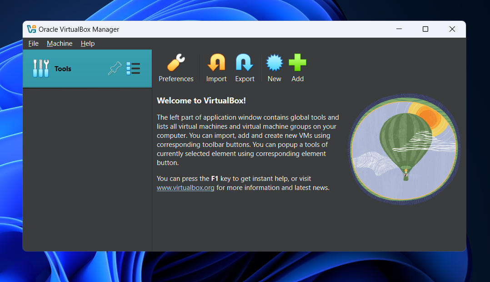

### Windows Server Installation
Configured Windows Server 2019 virtual machine with:

4 GB RAM
50 GB Storage
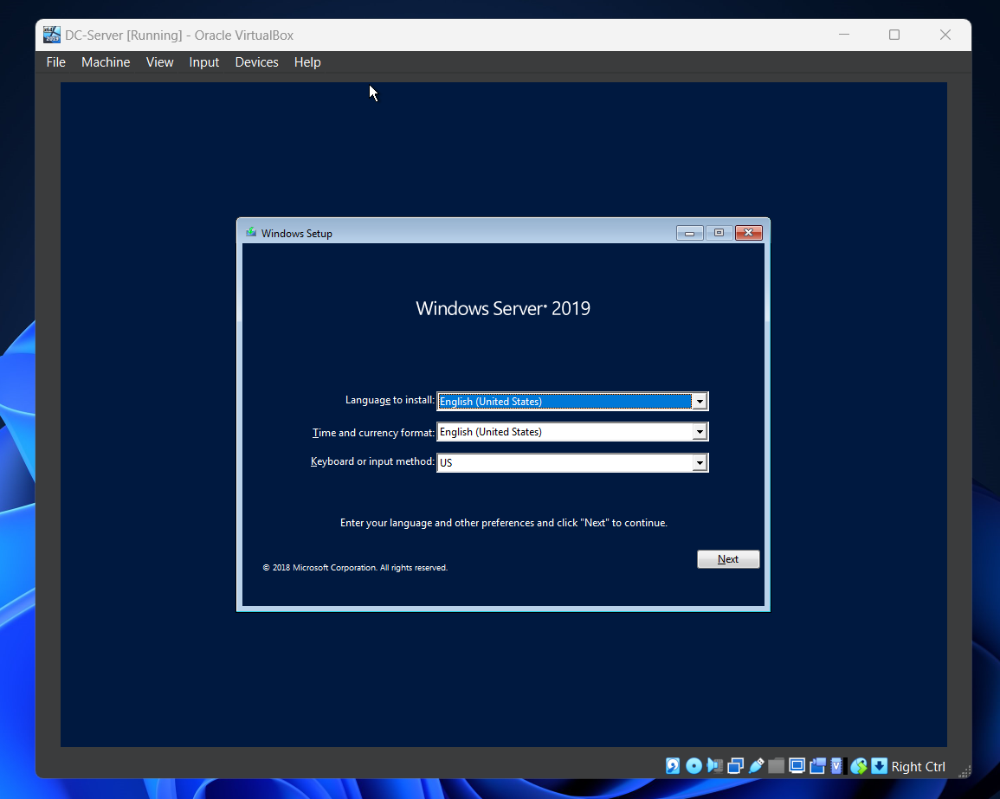

### 🌐 Network Configuration
Static IP Configuration

Configured DC01 with static IP address:

IP Address: 192.168.1.10
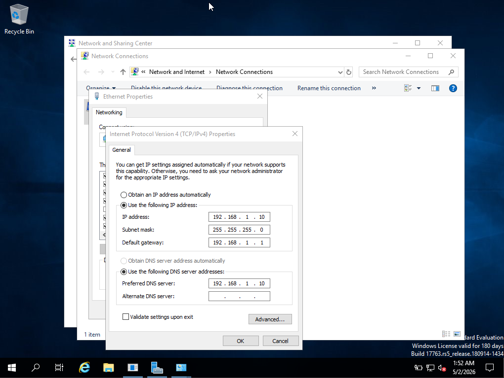

### Server Renaming

Renamed the server to DC01 before Active Directory deployment.
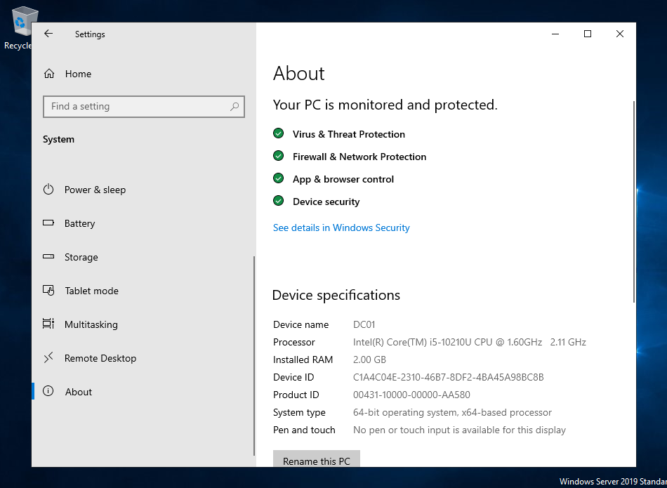

### 🏢 Active Directory Deployment
AD DS Installation

Installed Active Directory Domain Services role through Server Manager.
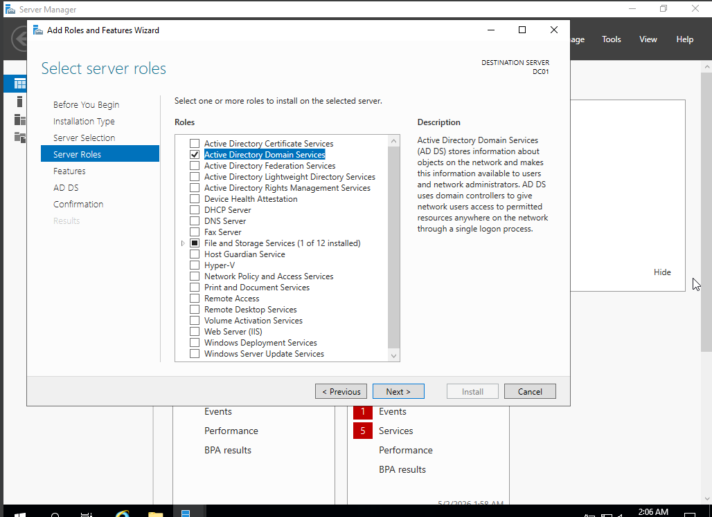

### Domain Controller Promotion

Promoted the server to a Domain Controller and created the forest: `piyushlab.local`
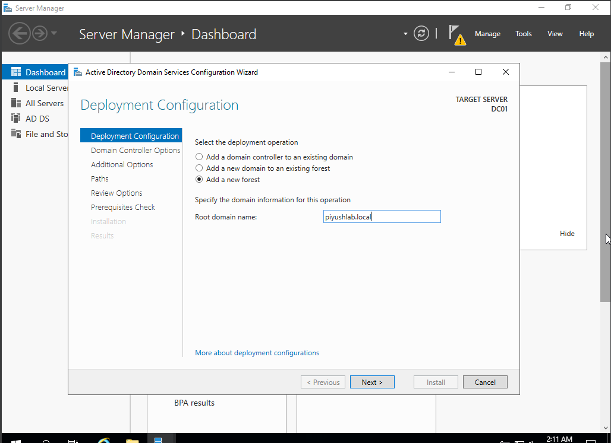

### 👥 Organizational Units & User Management
Organizational Unit Structure

Created departmental OUs:

HR
IT
Sales
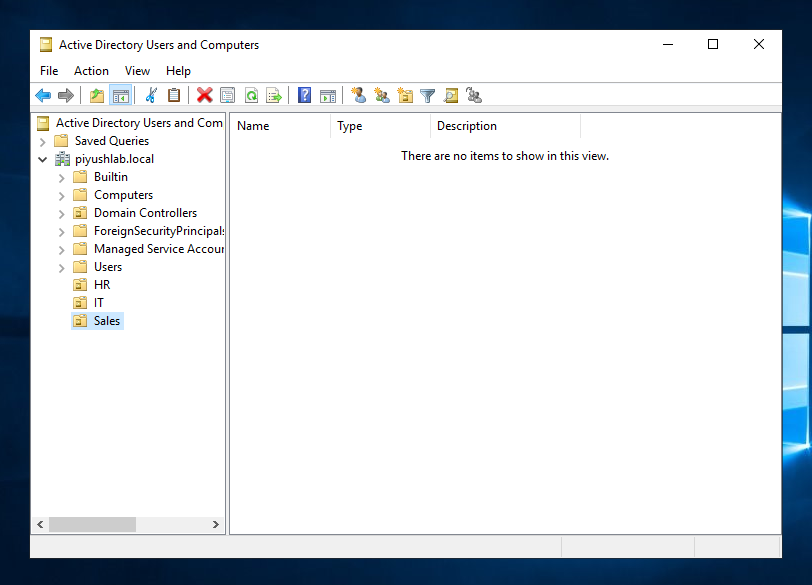

### User Creation

Added users across departments and organized them within respective OUs.
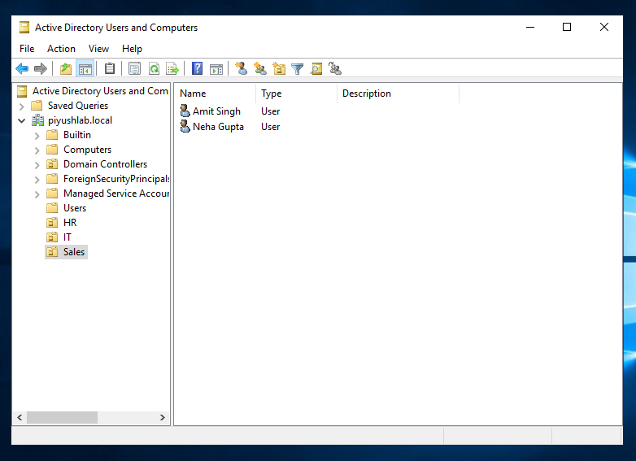

### Security Groups

Created departmental security groups:

HR_Group
IT_Group
Sales_Group

Configured group-based access management.
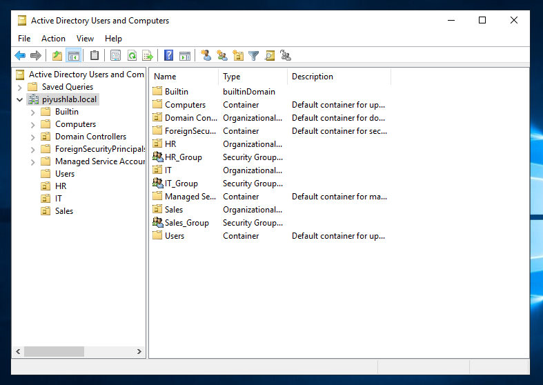

### 📂 Shared Resource Configuration
Shared Folder Setup

Created shared folder:

CompanyData

Configured role-based permissions for controlled departmental access.
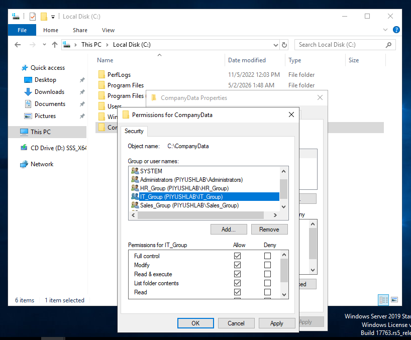

### 💻 Client Machine Deployment
Windows 10 Client Installation

Deployed Windows 10 client virtual machine:

CLIENT01
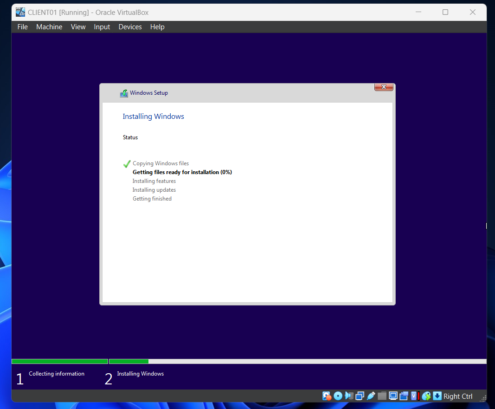

### Domain Join

Successfully joined CLIENT01 to:

piyushlab.local
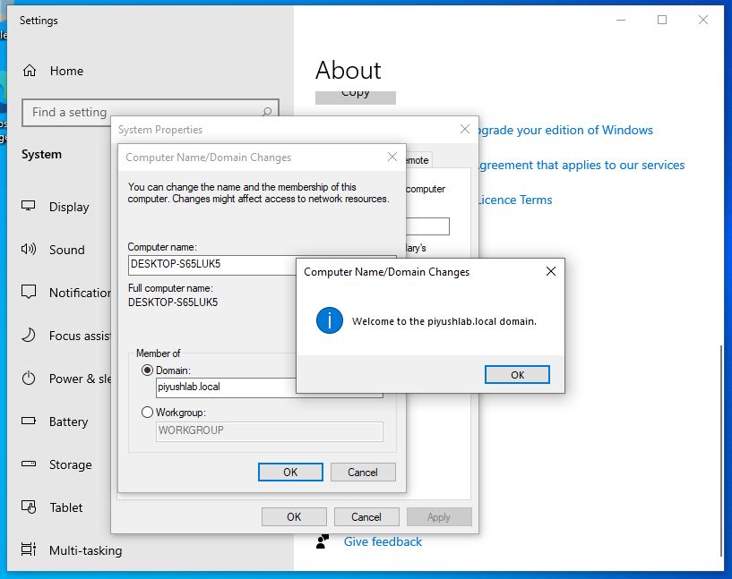

### 🔐 Group Policy Configuration
GPO Creation

Created Group Policy Object to restrict Control Panel access for Sales department users.
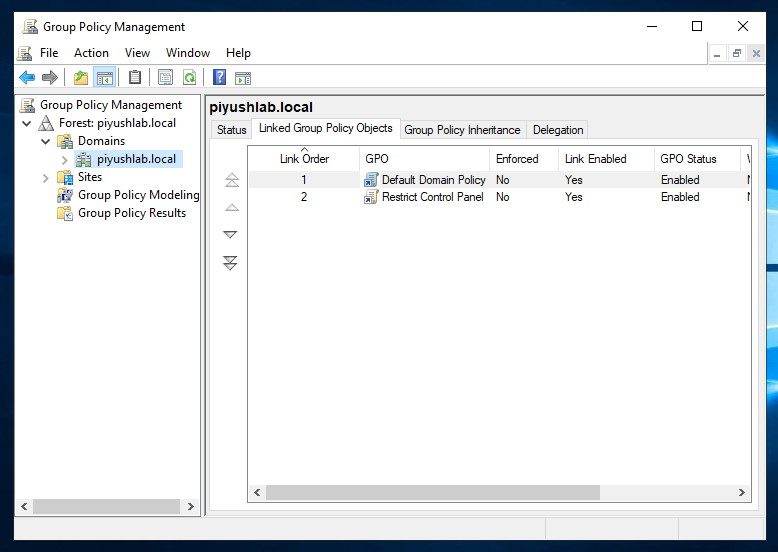

### Security Filtering

Applied policy specifically to the Sales OU.
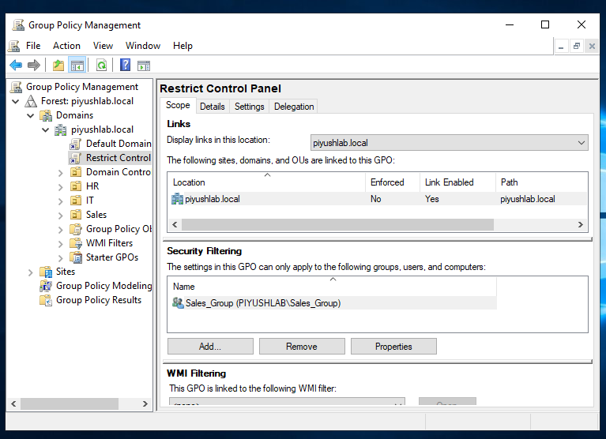

### Policy Enforcement

Validated successful enforcement of Control Panel restrictions.
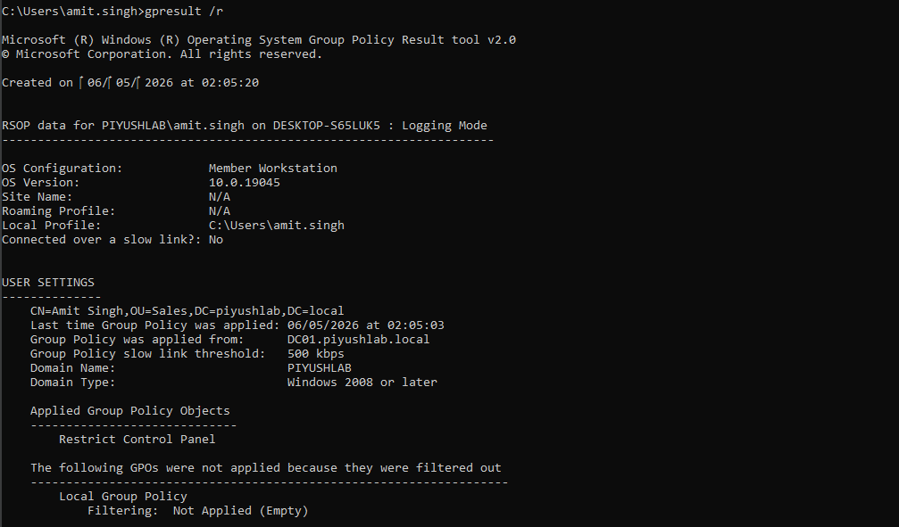

### 🛠 Troubleshooting
GPO Troubleshooting

Initially, the Control Panel restriction policy was not being applied correctly on the client machine.

Troubleshooting Steps
- Used `gpresult` to verify applied policies
- Identified incorrect GPO linking
- Linked the GPO correctly to the Sales OU
- Forced policy update using `gpupdate`
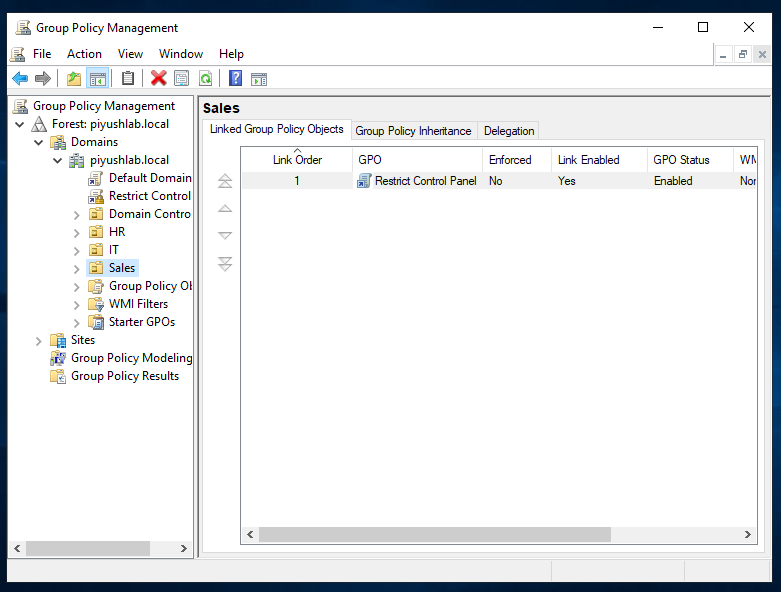

### Validation

Successfully confirmed policy application and restriction enforcement.
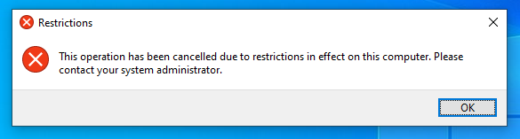

### 📚 Key Learnings
- Active Directory Domain Services deployment
- Organizational Unit management
- Group-based access control
- Windows domain administration
- Group Policy implementation
- Domain client configuration
- Basic enterprise troubleshooting workflow
